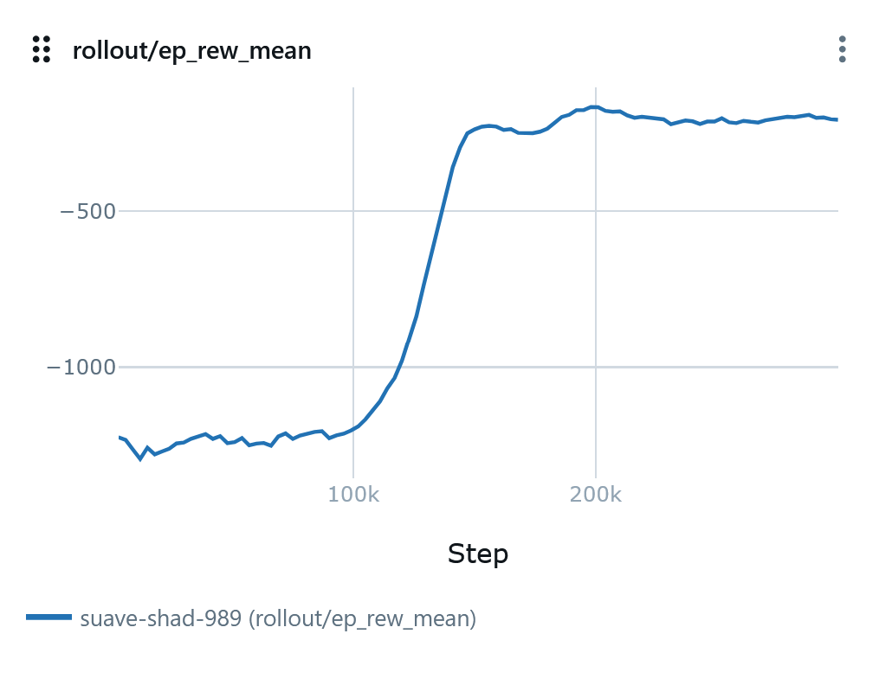
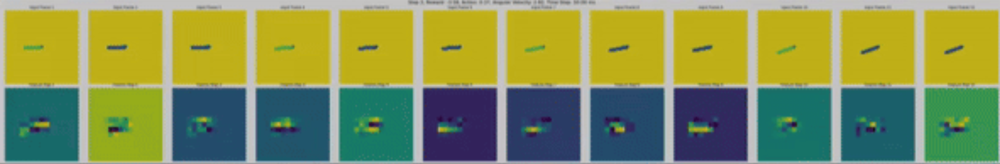

# Vis-Pendulum: Visual Pendulum Environment for Reinforcement Learning

A reinforcement learning environment featuring a pendulum with image observations, using Gymnasium and Stable-Baselines3 for training and evaluation.

<p align="center">
    
    
</p>
<div align="center">
  <em>Pendulum stabilization demonstration at the final training stage, along with the corresponding learning curve.</em>
</div>


## Overview

This project implements a visual version of the classic pendulum control problem. Instead of state vector observations, the agent receives rendered images of the pendulum. 

<p align="center">
  
</p>
<div align="center">
  <em>Illustration of image-based observations used for the vis-pendulum environment.</em>
</div>

The goal is to learn a policy that can stabilize the pendulum in an upright position by applying appropriate torques.

Key features:
- Image-based observation space instead of traditional state-based observations
- Custom CNN feature extractor for processing visual input
- Integration with MLflow for experiment tracking
- Support for rendering and video creation during evaluation

## Installation

### Using pip

1. Clone the repository:
```bash
git clone https://github.com/yourusername/vis-pendulum.git
cd vis-pendulum
```

2. Create a virtual environment and install dependencies:
```bash
python -m venv .venv
source .venv/bin/activate  # On Windows: .venv\Scripts\activate
pip install -e .
```

### Using uv (Recommended)

[uv](https://docs.astral.sh/uv/) is a fast Python package installer and resolver.

1. Install uv:
```bash
# Using pip
pip install uv

# Or using curl (Linux/macOS)
curl -LsSf https://astral.sh/uv/install.sh | sh

# Or using PowerShell (Windows)
irm https://astral.sh/uv/install.ps1 | iex
```

2. Clone the repository:
```bash
git clone https://github.com/yourusername/vis-pendulum.git
cd vis-pendulum
```

3. Install the project with uv:
```bash
# Install all dependencies and create a virtual environment automatically
uv sync

# Or with development extras if available
uv sync --dev
```

## Project Structure

```
vis-pendulum/
├── run/                # Training and evaluation scripts
│   ├── scripts/        # Utility scripts
│   ├── artifacts/      # Training artifacts (models, videos)
│   ├── mlruns/         # MLflow experiment data
│   ├── train_ppo_vispendulum.py  # Training script for PPO
│   └── eval_vispendulum.py       # Evaluation script
├── src/                # Core implementation
│   ├── envs/           # Environment implementations
│   │   └── visual_pendulum.py    # Visual pendulum environment
│   ├── utils/          # Utility functions
│   ├── wrapper/        # Environment wrappers
│   ├── model.py        # Custom neural network models
│   └── __init__.py     # Package initialization
├── .venv/              # Virtual environment
├── pyproject.toml      # Project metadata and dependencies
└── LICENSE             # License information
```

## Usage

### Training

To train a PPO agent on the visual pendulum environment:

Using Python directly:
```bash
python run/train_ppo_vispendulum.py --env_id VisualPendulumClassicReward --total_timesteps 300000
```

Using uv:
```bash
uv run python run/train_ppo_vispendulum.py --env_id VisualPendulumClassicReward --total_timesteps 300000
```

Key parameters:
- `--env_id`: Environment ID (`VisualPendulumClassicReward` or `VisualPendulumUpswingReward`)
- `--total_timesteps`: Total number of training timesteps
- `--n_envs`: Number of parallel environments
- `--seed`: Random seed for reproducibility

Check `run/train_ppo_vispendulum.py` for all available parameters.

### Evaluation

To evaluate a trained model:

Using Python directly:
```bash
python run/eval_vispendulum.py --checkpoint_path /path/to/model.zip --n_steps 200
```

Using uv:
```bash
uv run python run/eval_vispendulum.py --checkpoint_path /path/to/model.zip --n_steps 200
```

Key parameters:
- `--checkpoint_path`: Path to the model checkpoint
- `--n_steps`: Number of evaluation steps
- `--n_envs`: Number of parallel environments
- `--render`: Whether to render the environment and save videos

## Environment Details

The VisualPendulum environment replaces the typical state observation with rendered images. The agent's task is to control the pendulum by applying torques to swing it up and keep it upright.

Two reward variants are available:
- `VisualPendulumClassicReward`: Standard pendulum reward based on angle and velocity
- `VisualPendulumUpswingReward`: Reward focused on swinging up to the upright position

## Experiment Tracking

The project uses MLflow for experiment tracking. To view experiment results:

```bash
mlflow ui
```

Then navigate to http://localhost:5000 in your web browser.

## License

See the LICENSE file for details.
